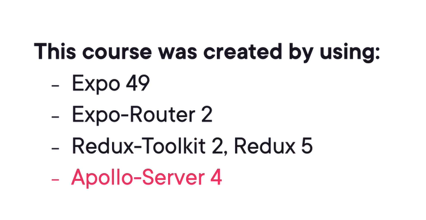

# Course Overview

## Course Overview

# Introduction

## Introduction

## Module Overview

## The Globomantics Developer Conference

## Demo: Existing Website

## Demo: Project Structure

## Demo: GraphQL API

## Where We're Heading

## Course Overview

# Setting up the Development Environment

## Overview

## Expo Boilerplate Setup

## Demo: Expo Boilerplate Setup

## Redux And Redux Toolkit

## Demo: Redux Setup

## Demo: RTK Query

## Demo: RTK Query Code Generation
* specify what we want to do with the query and mutation and code gen does the rest

## Demo: Styling with Nativewind

## Summary

# Viewing Sessions and Speakers

## Overview

## GraphQL Refresher

## Demo: Creating The Sessions Screen

## Demo: Creating The Speakers Screen

## Demo: Error Handling And Prevention

## Summary

# Implementing Sign-Up and Sign-In

## Overview

## Demo: Sign In Screen

## Demo: Sign Up Screen

## Demo: Global Authentication State

## Demo: Persisting Values With Redux Persist
* Redux toolkit is strict about serialize blue stuff

## Demo: Protected Access And Sign Out

## Demo: Server Request Authorization

## Summary

# Marking Sessions as Favorites

## Overview

## Demo: Marking Sessions As Favorites

## Demo: Fetching Favorite Sessions

## Demo: Creating The Favorites Screen

## Demo: Cache Invalidation With Tags

## Demo: Optimistic Updates

## Summary

# Submitting New Sessions

## Overview

## Demo: Creating the New Session Screen

## Demo: Implementing the Form

## Demo: Submitting the Session Data

## Demo: Showing My Sessions on the Home Screen

## Demo: Keeping DRY with Fragments

## Summary

# Next Steps and Parting Thoughts

## Where We Are

## Next Steps

## Parting Thoughts